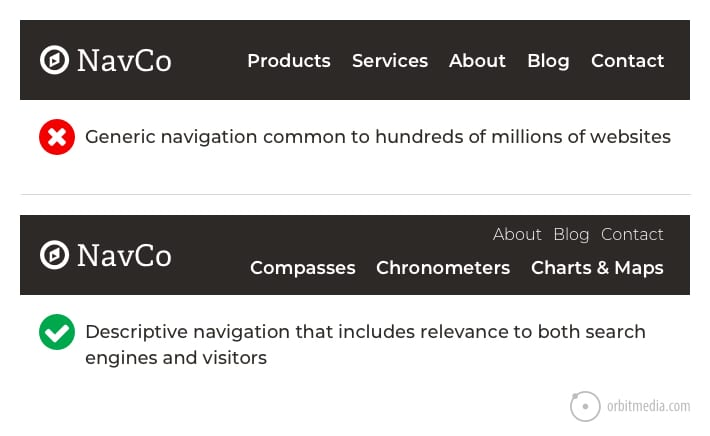
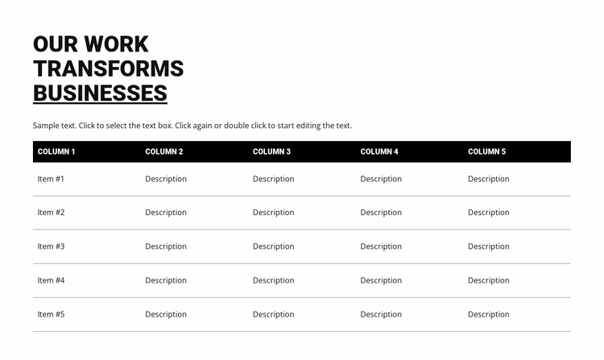
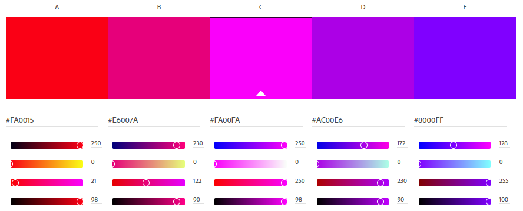

Recognition rather than recall
------------------------------
* I am going to make the information pages easy to view and also make it easy to traverse between the different pages.
  I might use visuals such as icons to make clear indications.
  

Aesthetic and Minimalist Design
-------------------------------
* I am only going to include the necessary information by using tables rather than full on paragraphs.
  As I would like to say, I am going to make it in Powerpoint Format not Word Format.
  

Project Polish
--------------
* I am using Purple, Pink, Red, Black, and White. I chose black as the background color because I like dark themes. Also, both pink and purple feel like space which is on-theme. Furthermore, purple is my favorite color and it works well with black. Lastly, I like that the color palette are cool colors and warm colors that are next to one another on the color wheel.
* I am going to use 1-3 fonts, if I use multiple it is likely that it will be to separate the headers, paragraphs, and table text. Another typographic convention I will use is changing the text colors based on format type such as headers and paragraphs. I might bold important information such as instructions to the user. Additionally, I might talicize when there is a lack of information such as N/A. Lastly, I might use bulleted lists when listing information oustide of the tables.

