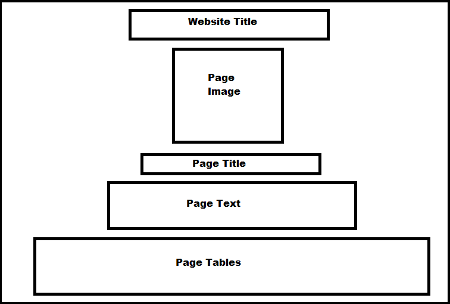
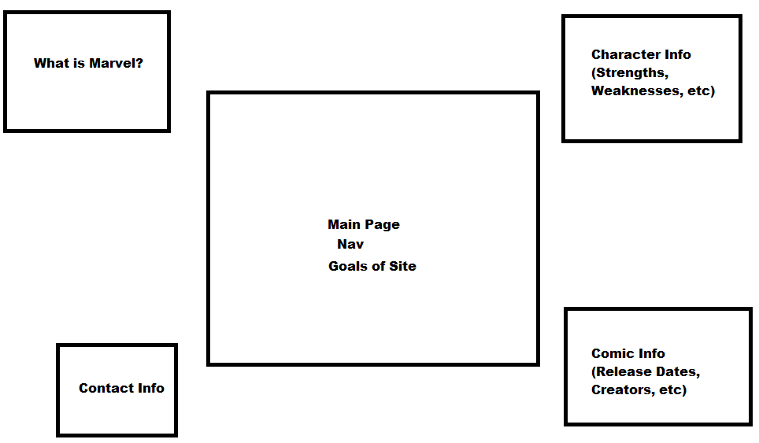

The Collector's Vault
===========================

My project will provide information about different Marvel Superheroes. It will be named "The Collector's Vault" based on the Collector from Marvel and the "Vault" kinda symbolizes the collection of data that I will be using. I will give information about multiple heroes and possibly even villains from Marvel using the data. I will choose these heroes based on my family and friends' favorites. The main page will explain what the website is about and will provide a starting location until you navigate to other pages. 
The "What is Marvel?" page will give different information on how Marvel was created and an explanation of what it is about. The "Contact Page" will be used to contact the creator of the website. My project will also have two pages based on Marvel characters. One page will give info about the characters such as strengths and weaknesses. The other will give info related to their comics such as their first release and their creator.

Web Service
-----------

[Marvel Developer Portal](https://developer.marvel.com/) apiKey

* [characters](https://developer.marvel.com/docs#!/public/getCharacterIndividual_get_1) GET

* [comics](https://developer.marvel.com/docs#!/public/getComicsCharacterCollection_get_2) GET

* [creators](https://developer.marvel.com/docs#!/public/getCreatorIndividual_get_13) GET

Database Use
------------

I will have a character table on the character page. It will have multiple categories of information. The first category will be the name of the hero to tell who the rest of the information is about. Other information will include powers and weapons. Additionally, their profile will be provided which will include race, gender, and role (such as Hero, Villain, and/or Anti-Hero). I will have to use tables containing character information. I will use both databases and hand-pick specific data to place in my own public database cache.
I will have a comic table on the comic page. It will have multiple different characters and will give information about their comics. For example, one of the categories of information will be what comic they first appeared in. Furthermore, I will include the release date. Additionally, who created the character themselves. I will have to use tables containing comic information. I will use both databases and hand-pick specific data to place in my own public database cache.

Initial Designs
---------------

